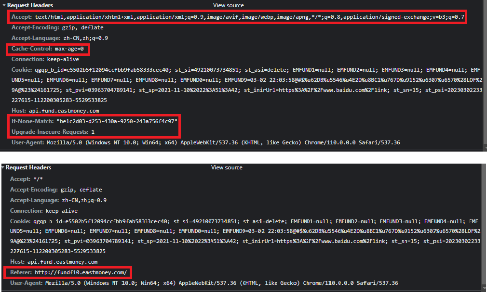

解题过程
===
## 页面分析
1. 浏览基金页面找到净值数据页面
   - `http://fundf10.eastmoney.com/jjjz_290008.html`
2. F12检查获取数据的请求头，确定净值获取的api：
   - `http://api.fund.eastmoney.com/f10/lsjz?callback=jQuery18307682204501251404_1677750744040&fundCode=290008&pageIndex=5&pageSize=20&startDate=&endDate=&_=1677750759141`
3. 找到基金列表（以开放型基金为例）
   - `http://fund.eastmoney.com/fund.html`
4. F12确定基金列表API
   `http://fund.eastmoney.com/Data/Fund_JJJZ_Data.aspx?t=1&lx=1&letter=&gsid=&text=&sort=zdf,desc&page=2,200&dt=1677765900402&atfc=&onlySale=0`

## API分析
1. 分析api结构
   1. 净值api
   ```python
    url = 'http://api.fund.eastmoney.com/f10/lsjz' #净值url
    params = {
      'callback':'jQuery18307682204501251404_1677750744040',   #回调函数
      'fundCode':290008,   #基金代码
      'pageIndex':5,       #分页
      'pageSize':20,        #页面数据量
      'startDate':'',      #开始日期
      'endDate':'',        #结束日期
      '_':1677750759141,   #时间戳（当前时间戳
    }
   ```
   - 可见只有总页数和callback不确定
   2. 基金列表api
   ```python
   url = 'http://fund.eastmoney.com/Data/Fund_JJJZ_Data.aspx' #开放型基金列表url
   params = {
      't':1,
      'lx':1,
      'letter':'',
      'gsid':'',
      'text':'',
      'sort':'zdf,desc',
      'page':'2,200',            #页码，每页数量
      'dt':'1677765900402',      #时间戳
      'atfc':'',
      'onlySale':0
   }
   ```
   - 测试得该api可以直接调取
2. 从网页源代码中找到api调用的相关语句
   ```javascript
   var strcode = pObj.code;
   var pageindex = pObj.pindex;
   var pers = pObj.pernum;
   var sdate = pObj.startDate;
   var edate = pObj.endDate;
   var request = apiHost + "/f10/lsjz?callback=?&fundCode=" + strcode + "&pageIndex=" + pageindex + "&pageSize=" + pers + "&startDate=" + sdate + "&endDate=" + edate;
   ```
   - 可见callback是jQuery自动生成的
3. 找到jQuery 回调函数相关代码
   ```javascript
       var Mn = []
      , _n = /\?/
      , Dn = /(=)\?(?=&|$)|\?\?/
      , Pn = v.now();
       v.ajaxSetup({
        jsonp: "callback",
        jsonpCallback: function() {
            var e = Mn.pop() || v.expando + "_" + Pn++;
            return this[e] = !0,
            e
        }
    }),
    ```
    - 可见是v.expando和当前时间戳加1
    ```javascript
        v.extend({
        cache: {},
        deletedIds: [],
        uuid: 0,
        expando: "jQuery" + (v.fn.jquery + Math.random()).replace(/\D/g, ""),
        noData: {
            embed: !0,
            object: "clsid:D27CDB6E-AE6D-11cf-96B8-444553540000",
            applet: !0
        },
   ```
   - 找到v.fn.jquery`jquery: "1.8.3"`
   - 分析可知`callback`=`jQuery`  `183` `0-1随机浮点数去掉小数点` `_当前时间戳`
  
4. 最终api结构
   ```python
    url='http://api.fund.eastmoney.com/f10/lsjz' #净值url
    params={
      'callback':'jQuery18307682204501251404_1677750744040',   #回调函数
      'fundCode':290008,   #基金代码
      'pageIndex':5,       #分页
      'pageSize':20,        #页面数据量
      'startDate':'',      #开始日期
      'endDate':'',        #结束日期
      '_':1677750759141,   #时间戳（当前时间戳
    }
   ```
## 数据获取
1. 确定数据获取流程
   1. 获取基金列表（取开放式基金3页每页10条共30条）配置项可改，能获取共16000余条全量数据
   2. 分析网页获取单条基金总页数
      - 实践中发现api接口中有数据总条数
      - 直接将第一页的数据量改为数据总量
   3. 通过api获取单条基金所有历史数据

2. 遇到的技术难点
   1. 用生成好的api get请求失败
   - 
   - 观察并测试后发现需要在请求头中添加Referer才能正确请求到数据

## 数据清洗落盘
1. 将获取好的数据转化为所需格式
   - 交易所净值数据不仅包含交易日，类似年末、季末的非交易日也会结算净值，此时api数据没有日增长率项，用于筛去非交易日数据
   - 没有净值的日期无法参与计算，筛去
2. 将获取好的数据按产品合约分组加入队列
3. 数据获取线程将队列中的数据取出并插入数据库

## 数据处理分析
1. 启用一个新的程序入口
2. 使用pandas读取数据库中数据
3. 使用pandas和numpy尽可能使用列操作和聚合的方法生成所需所有指标
4. 指标细节：
   1. 收益：期间总收益
   2. 年化收益：期间日均收益*252
   3. 最大回撤：在每一个单调区间内找到最高点，假如该最高点比之前所有最高点要高的话，以该最高点为起点计算后续区间最大回撤，最终返回整个区间内最大的最大回撤
   4. 夏普比率：计算出年化无风险利率，年化收益率，年化波动率后使用公式`（年化收益率-年化无风险利率）/年化波动率`
5. 使用pandas将计算出的指标落盘csv格式


## 补齐本地处理模式
1. 配置文件中增加'local'和'mysql'的选项
2. 数据获取补上本地输出到download
3. 数据处理补上本地读取download